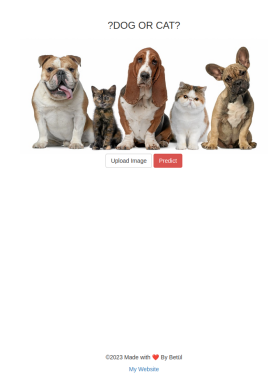
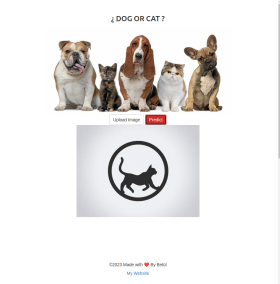
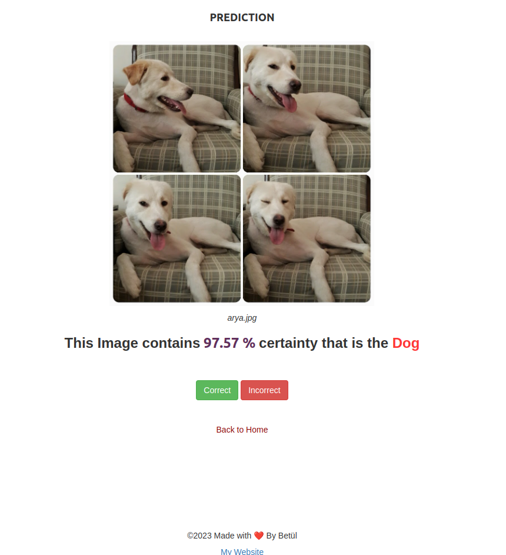

[Play with the App]()

# Building a Dog vs. Cat Image Classifier using MobileNet and Flask

This is a simple Flask app that uses a convolutional neural network(CNN) model to classify images as either a dog or a cat.

## Description

The model is built using the MobileNet architecture and trained on the [Dogs vs. Cats dataset](https://www.kaggle.com/c/dogs-vs-cats/data) provided by Microsoft Research, which contains 25,000 images of dogs and cats labeled as 1 (dog) or 0 (cat).

**HOME PAGE(index.html)**

<p align="center">



</p>

**PREDICT BUTTON**

<p align="center">



</p>

**PREDICTION PAGE(predict.html)**

<p align="center">



</p>

## Project Goals

The main goals of this project are to:

* Build a deep neural network using MobileNet to classify images of dogs and cats
* Create a Flask application that allows users to upload photos and receive real-time predictions of whether the photo contains a dog or a cat

## Tools Used

* Tensorflow
* Keras
* MobileNet
* h5py
* Flask
* Bootstrap
* Heroku


## Results

The final model achieved an accuracy of 98% on the test set, ** which is good performance for the dataset we got as 2000. The model is saved in the `cats_dogs_classifierv2.h5` file, and can be loaded and used for future predictions.

## How it Works: Convolutional Neural Networks (CNN)

<p align="center">
  
</p>

A CNN is a deep learning model that is commonly used for image classification tasks. In this project, we used the MobileNet architecture, which is optimized for mobile devices and has a small memory footprint. The model is trained on the Dogs vs. Cats dataset using TensorFlow and Keras. The MobileNet of the model is available [here](https://github.com/badl7/TensorFlow_Developer/blob/main/Cnn_in_TensorFlow/CNNs/Cats_vs_Dogs_MobileNetv2.ipynb). Also Inception of the model is available [here](https://github.com/badl7/TensorFlow_Developer/blob/main/Cnn_in_TensorFlow/CNNs/inception_v3_catVSdog.ipynb).

You can find details in the [article](https://medium.com/@betul.gurbuz.dev/convnets-cnn-74aa18f2d543).
## Docker
```%bash
docker push badl7/catdogflaskapp
```
## Next Steps

Here are some ideas for further development:

* Deploy the app using Docker
* Add more models, such as
  * VGG-16
  * ResNet50
*
